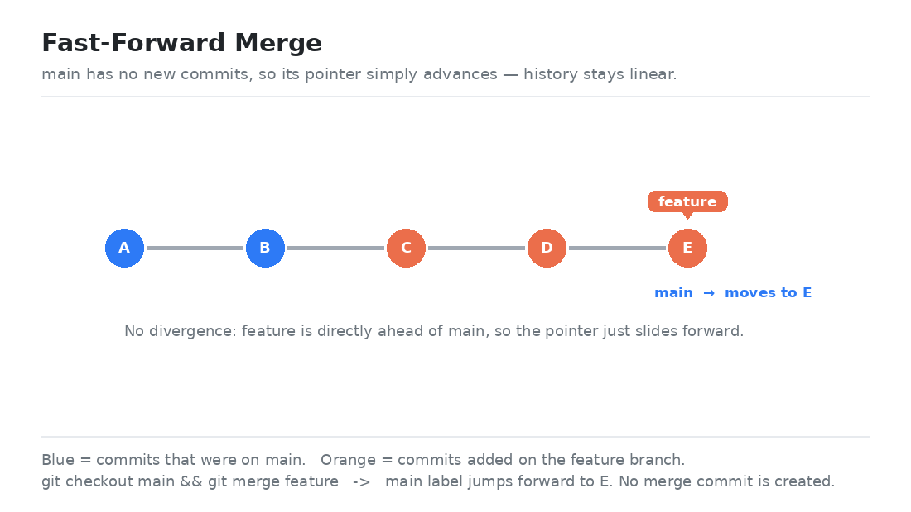
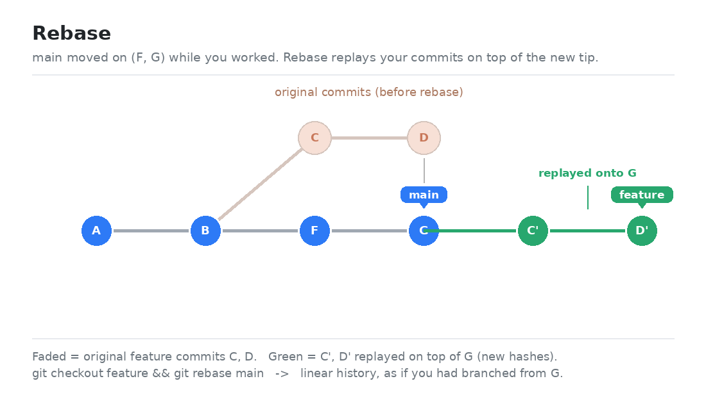

# Git Workflow Best Practices

A practical guide to a clean, collaborative Git workflow: how to branch, how to
use pull requests, and how to keep history readable — including the difference
between a **rebase** and a **fast-forward**.

---

## Table of Contents

1. [Core Principles](#core-principles)
2. [Branching](#branching)
3. [Pull Requests](#pull-requests)
4. [Protecting `main`](#protecting-main)
5. [Rebase vs. Fast-Forward](#rebase-vs-fast-forward)
6. [Quick Reference](#quick-reference)

---

## Core Principles

- **`main` is always releasable.** Never commit directly to `main`; every change
  arrives through a reviewed pull request.
- **Branches are short-lived.** Open a branch, ship it, delete it. Long-running
  branches drift and cause painful merges.
- **Commits are small and atomic.** Each commit should do one thing and have a
  message that explains *why*, not just *what*.
- **Keep history readable.** A linear, intentional history is far easier to
  bisect, revert, and review than a tangle of merge commits.

---

## Branching

### Naming convention

Use a `type/short-description` pattern so branches sort and read well:

```
feature/user-login
fix/null-pointer-on-checkout
chore/bump-dependencies
docs/api-readme
```

### Everyday branching commands

```bash
# Start from an up-to-date main
git checkout main
git pull origin main

# Create and switch to a new branch
git checkout -b feature/user-login

# ... make changes ...
git add .
git commit -m "Add email/password login form"

# Push the branch and set its upstream
git push -u origin feature/user-login
```

### Keeping your branch current

While you work, `main` keeps moving. Refresh your branch regularly so the final
merge is boring (which is what you want):

```bash
git checkout feature/user-login
git fetch origin
git rebase origin/main      # replay your work on top of the latest main
```

> **Rule of thumb:** rebase your *own* unpushed/feature work to keep it tidy;
> never rebase commits that other people have already pulled.

---

## Pull Requests

Pull requests (PRs) are where code gets reviewed, discussed, and verified by CI
before it touches `main`.

### A good PR workflow

1. **Push your branch** and open a PR against `main`.
2. **Write a clear description** — what changed, why, and how to test it.
3. **Keep it small.** A PR under ~400 lines gets reviewed faster and better.
4. **Let CI run.** Tests and linters must be green before review.
5. **Address feedback** with additional commits (easy to review), then squash on
   merge if you want a single clean commit.
6. **Merge, then delete the branch.**

### Opening a PR from the command line

Using the GitHub CLI ([`gh`](https://cli.github.com/)):

```bash
gh pr create \
  --base main \
  --head feature/user-login \
  --title "Add email/password login" \
  --body "Adds a login form and session handling. Closes #42."
```

### Example PR description template

```markdown
## What
Adds email/password login with server-side session handling.

## Why
Users currently have no way to authenticate. Closes #42.

## How to test
1. Run `npm start`
2. Visit /login and sign in with a seeded account
3. Confirm you're redirected to /dashboard

## Notes
- Passwords are hashed with bcrypt (cost 12).
```

### Merge strategies at a glance

| Strategy           | Result                                  | Best for |
| ------------------ | --------------------------------------- | -------- |
| **Squash & merge** | All PR commits collapse into one        | Most feature work — keeps `main` clean |
| **Rebase & merge** | Commits replayed onto `main`, no merge commit | Preserving a curated commit-by-commit history |
| **Merge commit**   | Explicit merge commit ties the branch in | Long-lived branches where you want the merge recorded |

---

## Protecting `main`

Protecting `main` means making it *impossible* (or at least hard) to push broken
or unreviewed code straight to it. There are two complementary layers: a
**server-side** layer enforced by GitHub, and a **local** layer enforced on your
own machine.

### Layer 1 — Server-side: GitHub branch protection / rulesets

GitHub can enforce rules on `main` for everyone who pushes. The recommended
mechanism is a **ruleset** (the modern replacement for "classic" branch
protection). Useful rules include:

| Rule | Effect |
| --- | --- |
| Require a pull request before merging | No direct pushes; changes arrive via PR |
| Require approvals | PR needs *N* reviews before it can merge |
| Dismiss stale approvals on push | New commits re-open review |
| Require status checks (CI) to pass | Tests must be green before merge |
| Require linear history | Forbids merge commits (squash/rebase only) |
| Block force pushes (`non_fast_forward`) | Nobody can rewrite `main`'s history |
| Restrict deletions | `main` cannot be deleted |
| Include administrators | Rules apply to admins too — no bypass |

Create a ruleset from the command line with the GitHub CLI:

```bash
gh api -X POST repos/<owner>/<repo>/rulesets --input ruleset.json
```

```json
{
  "name": "protect-main",
  "target": "branch",
  "enforcement": "active",
  "conditions": { "ref_name": { "include": ["refs/heads/main"], "exclude": [] } },
  "rules": [
    { "type": "deletion" },
    { "type": "non_fast_forward" },
    { "type": "required_linear_history" },
    { "type": "pull_request",
      "parameters": {
        "required_approving_review_count": 1,
        "dismiss_stale_reviews_on_push": true,
        "allowed_merge_methods": ["squash", "rebase"]
      }
    }
  ]
}
```

> ⚠️ **Plan requirement:** branch protection and rulesets on a **private**
> repository require **GitHub Pro/Team/Enterprise**. On a free personal account a
> private repo's ruleset request is rejected with *"Upgrade to GitHub Pro or make
> this repository public."* Branch protection is free on **public** repos.
> If you can't enable the server-side layer, rely on Layer 2 below.

### Layer 2 — Local: a `pre-push` hook

A Git hook runs on *your* machine and can refuse a push before it ever leaves
your computer. This works on any plan, including free private repos — the
trade-off is that it only protects clones where the hook is installed, and it can
be bypassed with `--no-verify`. It's defense in depth, not a substitute for
server-side rules.

This repo ships such a hook at [`.githooks/pre-push`](./.githooks/pre-push). It
blocks any push whose remote ref is `refs/heads/main`:

```bash
#!/usr/bin/env bash
protected_branch="main"
while read -r local_ref local_sha remote_ref remote_sha; do
  if [ "$remote_ref" = "refs/heads/$protected_branch" ]; then
    echo "✋ Blocked: direct push to '$protected_branch' is not allowed." >&2
    exit 1
  fi
done
exit 0
```

Enable it (once per clone) by pointing Git at the tracked hooks directory:

```bash
git config core.hooksPath .githooks
```

Now `git push origin main` is rejected locally; you push a feature branch and
open a PR instead. To intentionally bypass it (e.g. an initial setup commit):

```bash
git push --no-verify origin main
```

### Which layer should I use?

- **Public repo, or private on a paid plan:** enable the **server-side ruleset** —
  it's authoritative and applies to everyone. Add the local hook on top for fast,
  offline feedback.
- **Private repo on the free plan:** the server-side ruleset isn't available, so
  the **local `pre-push` hook** is your main guard. Keep the habit of always
  working on branches and merging via PR.

---

## Rebase vs. Fast-Forward

These two often get confused because both can produce a **linear history** — but
they answer different questions.

- **Fast-forward** is a kind of *merge*: "can I move the branch pointer forward
  without creating a merge commit?"
- **Rebase** *rewrites* commits: "replay my commits as if I had started from a
  different base."

### Fast-Forward

A fast-forward happens when the target branch has **no new commits** since you
branched off it. There's nothing to reconcile, so Git just slides the branch
pointer forward. **No merge commit is created.**



```bash
# main is still at B; feature added C, D, E on top of B
git checkout main
git merge feature        # fast-forward: 'main' label simply moves to E
```

History stays a single straight line — as if the feature commits had been made
on `main` all along.

To *force* a merge commit even when a fast-forward is possible (some teams prefer
this so every merge is recorded):

```bash
git merge --no-ff feature
```

### Rebase

Rebase is for when `main` **has** moved on while you were working. Instead of
creating a merge commit, rebase takes your commits, sets them aside, fast-forwards
your branch to the latest `main`, and then **replays your commits on top** —
giving each a *new hash* (so `C` becomes `C'`).



```bash
# main advanced to G (commits F, G) while you built C, D on feature
git checkout feature
git rebase main          # replays C, D as C', D' on top of G
```

The result is a clean, linear history with no merge bubble — as though you had
branched from `G` in the first place.

> ⚠️ **The golden rule of rebasing:** never rebase commits that have been pushed
> and that others may have based work on. Rebasing rewrites history, and shared
> rewritten history forces everyone else into painful conflicts. Rebase local /
> feature-only work; merge shared work.

### Side-by-side summary

| | Fast-forward | Rebase |
| --- | --- | --- |
| **What it does** | Moves the branch pointer forward | Replays commits onto a new base |
| **Creates a merge commit?** | No | No |
| **Rewrites history (new hashes)?** | No | **Yes** |
| **Possible when…** | Target branch has no new commits | Always (resolves divergence) |
| **Use it to…** | Integrate a branch that's strictly ahead | Update a branch whose base moved on |
| **Safe on shared branches?** | Yes | **No** — only on local/unshared commits |

---

## Quick Reference

```bash
# Branch
git checkout -b feature/x          # create + switch
git push -u origin feature/x       # publish

# Stay current
git fetch origin
git rebase origin/main             # replay your work on latest main

# Integrate
git merge feature                  # fast-forward when possible
git merge --no-ff feature          # always make a merge commit
git rebase main                    # linearize before merging

# Open a PR
gh pr create --base main --fill

# Clean up after merge
git branch -d feature/x            # delete local
git push origin --delete feature/x # delete remote
```

---

*Diagrams (`ff-merge.png`, `rebase.png`) are generated by `make_diagrams.py`.*
